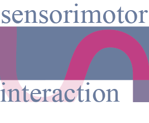

# Motion-Coupled Asymmetric Vibration

<div id="top"></div>


<!-- PROJECT SHIELDS -->
<!--
*** I'm using markdown "reference style" links for readability.
*** Reference links are enclosed in brackets [ ] instead of parentheses ( ).
*** See the bottom of this document for the declaration of the reference variables
*** for contributors-url, forks-url, etc. This is an optional, concise syntax you may use.
*** https://www.markdownguide.org/basic-syntax/#reference-style-links
-->
[![Contributors][contributors-shield]][contributors-url]
[![Forks][forks-shield]][forks-url]
[![Stargazers][stars-shield]][stars-url]
[![Issues][issues-shield]][issues-url]
[![MIT License][license-shield]][license-url]

<!-- PROJECT LOGO -->
<br />
<div align="center">
  <a href="https://sensint.mpi-inf.mpg.de/">
    
  </a>

<h3 align="center">Foot Pedal Control - The Role of Vibrotactile Feedback in Performance and Perceived Control</h3>

  <p align="center">
    <b>We'd love to get your feedback and know if you want to explore this research further.</b>
    <br />
<!--     <br />
    <a href="https://github.com/sensint/Servo_Haptics/issues">Report Bug</a>
    ·
    <a href="https://github.com/sensint/Servo_Haptics/issues">Request Feature</a> -->
  </p>
</div>


## About The Project

![Banner images][banner-image]

Feedback on foot pedals affects the user's ability to control dynamic systems. However, the interplay between objective performance and user's perceived control has not been formally investigated for foot pedals. Thus, we evaluated this interplay for 4 pedal configurations: rigid and compliant pedals with and without vibrotactile feedback synchronized with user action. We conducted a within-subjects study with 12 participants, consisting of (1) a one-dimensional following task, (2) a driving task in VR to measure user performance, and (3) qualitative interviews for understanding users' subjective control. The objective performance metrics showed no significant differences between the pedal configurations. In contrast, analysis of the interviews revealed that motion-coupled vibrotactile feedback increases the participants' perceived control. These results offer possibilities for designing customized pedal feedback without compromising performance. This research emphasizes evaluating objective performance as well as perceived control while assessing control strategies for existing and novel interfaces.

<p align="right">(<a href="#top">back to top</a>)</p>


### Built With

* [Teensyduino](https://www.pjrc.com/teensy/teensyduino.html)

<p align="right">(<a href="#top">back to top</a>)</p>

## Getting Started

Download the code from the GitHub website or clone repo using your favorite git-client software or with the following command:

   ```sh
   git clone https://github.com/sensint/HapticGasPedal.git
   ```
- To run the processing script (Targetting_Task.pde) as is, please add all the trajectories in the same folder as the processing file.
- Assign the right port for the serial communication.
- Run the script


### Firmware

We provide the firmware for one build system - Teensyduino (based on Arduino IDE).

The firmware was tested with the following microcontrollers:

- Teensy 4.1


#### Teensyduino

The easiest way to get up and running with the firmware is Teensyduino.

##### Prerequisites

Download and install the [Teensyduino](https://www.pjrc.com/teensy/td_download.html) software for your operating system. All needed libraries are included in the basic installation.


### Hardware

This project is based on the Teensy microcontroller and the [PT8211 Audio Kit](https://www.pjrc.com/store/pt8211_kit.html). For understanding the hardware and the underlying principles, please refer to [Haptic Servos](https://dl.acm.org/doi/full/10.1145/3544548.3580716).

<p align="right">(<a href="#top">back to top</a>)</p>


## Contributing

Contributions are what make the open source community such an amazing place to learn, inspire, and create. Any contributions you make are **greatly appreciated**.

If you have a suggestion that would make this better, please fork the repo and create a pull request. You can also simply open an issue with the tag "enhancement".
Don't forget to give the project a star! Thanks again!

1. Fork the Project
2. Create your Feature Branch (`git checkout -b feature/AmazingFeature`)
3. Commit your Changes (`git commit -m 'Add some AmazingFeature'`)
4. Push to the Branch (`git push origin feature/AmazingFeature`)
5. Open a Pull Request

<p align="right">(<a href="#top">back to top</a>)</p>


## License

Distributed under the MIT License. See `LICENSE.txt` for more information.

<p align="right">(<a href="#top">back to top</a>)</p>


## Contact

Sensorimotor Interaction Group - [website](https://sensint.mpi-inf.mpg.de/) - [@sensintgroup](https://twitter.com/sensintgroup)

Project Link: [https://github.com/sensint/HapticGasPedal](https://github.com/sensint/HapticGasPedal)

<p align="right">(<a href="#top">back to top</a>)</p>


## Acknowledgments

* Othneil Drew for [Best-README-Template](https://github.com/othneildrew/Best-README-Template)

<p align="right">(<a href="#top">back to top</a>)</p>


<!-- MARKDOWN LINKS & IMAGES -->
<!-- https://www.markdownguide.org/basic-syntax/#reference-style-links -->
[contributors-shield]: https://img.shields.io/github/contributors/sensint/HapticGasPedal.svg?style=for-the-badge
[contributors-url]: https://github.com/sensint/HapticGasPedal/graphs/contributors
[forks-shield]: https://img.shields.io/github/forks/sensint/HapticGasPedal.svg?style=for-the-badge
[forks-url]: https://github.com/sensint/HapticGasPedal/network/members
[stars-shield]: https://img.shields.io/github/stars/sensint/HapticGasPedal.svg?style=for-the-badge
[stars-url]: https://github.com/sensint/HapticGasPedal/stargazers
[issues-shield]: https://img.shields.io/github/issues/sensint/HapticGasPedal.svg?style=for-the-badge
[issues-url]: https://github.com/sensint/HapticGasPedal/issues
[license-shield]: https://img.shields.io/github/license/sensint/HapticGasPedal.svg?style=for-the-badge
[license-url]: https://github.com/sensint/HapticGasPedal/blob/master/LICENSE
[banner-image]: assets/img/Banner_GasPedal.png
